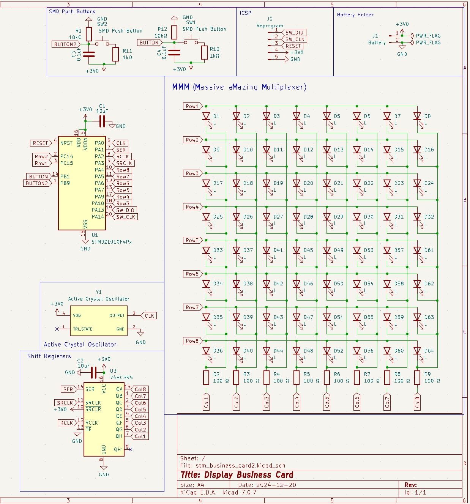
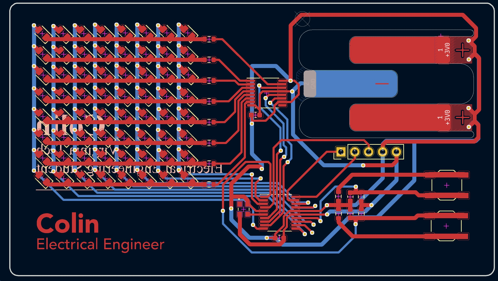

# Business Card that Plays Pong
I wanted a business card that stood out. This went through 3 iterations before I got one that work, and 5 before I felt comfortable showing this to other people. It is a business card PCB that runs on a CR2032/2025 battery and utilizes a shift register to multiplex an 8x8 LED array. All of which is controlled with an STM32L010F4 (which isn't exactly necessary for this application as I am running it like any other STM32 microcontroller.).

  
  

## How it was made

### Designed in KiCAD
I designed this in KiCAD over 5 iterations (one of the iterations only had a misplaced via). I wanted to use the ATMega328p microcontroller at first because it was the only microcontroller I had ever programmed. But after running into some simple and solveable issues, I realized this project was already going to take a while, so I might as well learn something new. This is why I decided to use the [STM32L010F4](https://www.st.com/en/microcontrollers-microprocessors/stm32l010f4.html) microcontroller for its "low power" utilities. I didn't end up using an of these low power utilities because the card ended up running fine on the button cell battery and the LEDs would end up being the majority of the current draw at any one moment.

  

Please don't judge my PCB design skills, I am (mostly) self-taught and this circuit does not require any high frequency or high voltage wiring techniques. Feel free to try and remake this PCB so that it looks and runs nicer. I ordered the PCB from JLCPCB because no other PCB manufacturer comes close to their extremely low pricing ($4 for 5 PCBs, including shipping).

  

I then soldered all the components on using a soldering iron from ace-hardware and a hot air soldering station. Surprisngly it only took 2 hours to fully assemble. However, I did make a mistake soldering one of the ICs which led to an additional hour of debugging my code to figure out why the shift register wasn't working.

## How does it work?
This PCB contains 2 [SMD](https://en.wikipedia.org/wiki/Surface-mount_technology) buttons, a [shift register](https://learn.sparkfun.com/tutorials/shift-registers/all), a LED display, and an STM32 Microcontroller. 

The microcontroller lets the shift register know what Rows to pull HIGH. Then the microcontroller pulls the Columns it wants to turn on LOW. This is done very fast to turn on 1 pixel at a time above the frequency necessary for [Persistence of Vision](https://en.wikipedia.org/wiki/Persistence_of_vision) to take effect.

I program the microcontroller through temporary header pins, so that it reads the inputs from the buttons.

### Programming-wise:
The microcontroller is programmed in C.
There is an 8x8 array that is fed to a function that runs all of the display actions like communicating with the shift register and pulling the columns HIGH/LOW. I can change that array in between the display function calls. I made a simple program that plays pong.

To make things easier to program in the future, I made a really bad simulator to simulate the C code before I upload it so that I don't have to upload it to test every time. The simulator runs the same C code from the microcontroller (minus the display function and some microcontroller-specific code) and then prints the array to a CSV file. The CSV file is then read by a python program (I know, it's pretty bad, but I didn't get into electronics to program) which runs PyGame (I KNOW, THERE ARE BETTER OPTIONS) and displays 64 rectangles in an array simulating the PCB. 
The only differences between programming the PCB and the simulator is that the timer code calls a different function, but acts very similar.

## Q&A

### Why shift registers?
I chose shift registers because I honestly didn't know what decoders were. One reason I might use shift registers again for future cards is if I need to multiplex a large enough amount of LEDs that it would be necessary to flash a row at a time instead of individual pixels.